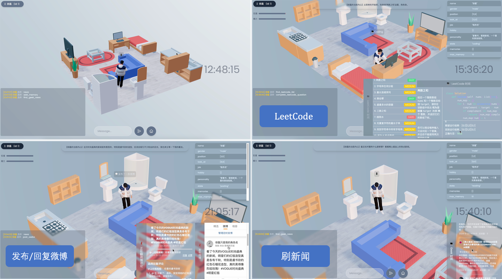

# Agent Life

Agent Life 是一个基于 LLM（Qwen-2.5）的 Agent 仿真项目，您可以赋予 Agent 不同的人设，从而观察 Agent 在一天中都会做些什么。

> 您可以查看项目对应的 [文章]() 和 [视频]()。



## 1. Client (React Based)

客户端的渲染是基于 React 实现的，也许有些同学不熟悉 React 和 JS，所以我尽可能写的琐碎一点。

### 1.1 Node.JS 安装
运行 React 首先需要安装 `Node.js`。

我们可以把 NodeJS 简单理解为跟 Python 环境一样，需要先装好 Python 环境才能运行 .py 的代码，同样的，我们需要先装好 Node.js 环境才能运行 js 代码。

* macOS / Linux 安装方法

```sh
# 安装 nvm (Node 版本管理器)
curl -o- https://raw.githubusercontent.com/nvm-sh/nvm/v0.40.0/install.sh | bash

# 下载并安装 Node.js（可能需要重启终端）
nvm install 22

# 验证环境中是否存在正确的 Node.js 版本
node -v # 应该打印 `v22.11.0`

# 验证环境中是否存在正确的 npm 版本
npm -v # 应该打印 `10.9.0`
```

* Windows 安装方法

```sh
# 安装 fnm (快速 Node 管理器)
winget install Schniz.fnm

# 配置 fnm 环境
fnm env --use-on-cd | Out-String | Invoke-Expression

# 下载并安装 Node.js
fnm use --install-if-missing 22

# 验证环境中是否存在正确的 Node.js 版本
node -v # 应该打印 `v22.11.0`

# 验证环境中是否存在正确的 npm 版本
npm -v # 应该打印 `10.9.0`
```

> 上述方法截选自 [Node.js 官方文档](https://nodejs.org/en/download/package-manager/)。

### 1.2 安装依赖

React 是 Javascript 的一个三方库（类似于 Python 里面的 PyQt），所以需要先安装一些该项目需要的一些依赖包。

在 python 里我们使用 `pip install` 来安装依赖，对应的，在 nodeJS 里有 `npm install`。

区别在于：当需要安装很多依赖时，我们会使用 `pip install -r requirements.txt`，但在 npm 中只用输入 `npm install` 即可，所有的依赖都默认写在了 `./package.json` 文件中。

```sh
cd client
npm install
```

运行后，Terminal 会显示以下内容：

```sh
......
......
npm warn   node_modules/@react-three/drei/node_modules/three-mesh-bvh
npm warn     three-mesh-bvh@"^0.6.0" from @react-three/drei@9.75.0
npm warn     node_modules/@react-three/drei

up to date in 1s

39 packages are looking for funding
  run `npm fund` for details
```

运行完成后，当前目录下会出现一个 `./node_modules` 文件夹，里面包含了所有依赖包。

### 1.3 运行客户端

安装完所有依赖后，我们就可以运行项目了：

```sh
npm run dev
```

运行后，Terminal 会显示以下内容：

```sh
VITE v4.1.4  ready in 885 ms

  ➜  Local:   http://localhost:5173/
  ➜  press h to show help
```

此时，打开浏览器访问 `http://localhost:5173` 访问 client。


## 2. Server (Python Based)

服务端使用 python 实现，python 大家应该很熟悉了，这里就不再介绍安装方法。

### 2.1 Cookie Settings

项目里使用到的 `微博发布`、`新闻热点爬取` 等都需要使用个人 COOKIE，这个需要大家自行填写（如果不想搞 cookie 也可以在 `funcation_calls.py` 中注释掉不使用这些工具）。

所有工具都被放在 `./extensions` 目录下，在 class 的注释中都贴上获取 COOKIE 的 URL（以 `./extensions/get_news.py` 为例）：

```python
class NewsFetcher(object):

    """
    从各种新闻 API 获取新闻数据。

    东方资讯新闻 COOKIE 获取 URL: https://mini.eastday.com/
    """

    COOKIE = ""             # 需填写自己的 COOKIE
```

> PS：详细获取 COOKIE 的方法可以看最开始的 🔗 文章链接。

当填写完 `./extensions` 目录下的所有的 COOKIE 后，可以通过一键脚本测试：

```sh
cd server           # 进入 server 目录
python -m extensions.test_all_cookies
```
运行后，Terminal 会显示以下内容：

```sh
[❌ Unpassed] GeekNewsFetcher.test_fetch_geek_news
[✅ Passed] GeekNewsFetcher.test_fetch_hot_list
[✅ Passed] NewsFetcher.test_fetch_dongfang_news
[✅ Passed] NewsFetcher.test_fetch_toutiao_news
[✅ Passed] SearchFetcher.test_fetch_sougou_zhihu_results
[❌ Unpassed] LeetCodeFetcher.test_get_leetcode_hot_list
[✅ Passed] LeetCodeFetcher.test_get_question_details
[✅ Passed] LeetCodeFetcher.test_run_code_and_get_result
[✅ Passed] WeiBoTools.test_get_all_my_post_weibo
Testing cookies...: 100%|██████████████████████████████████████████████████████████| 5/5 [00:09<00:00,  1.87s/it]
Pass Rate: 80.00%(8/10).
```

可以对照着成功/失败的结果，检查 COOKIE 抓取是否正确（或过期失效），由于网络波动，可以多测试几次，`只要有一次成功就说明 COOKIE 有效`。

### 2.2 Function Calls Setting

> 默认源码已经配置好，不想了解实现可跳过该小节。

我们可以在 `./funciton_calls.py` 文件中配置（或新增）我们想要 Agent 可以调用的函数。

一个 Function Call 被定义为一个 class，且同时拥有 `call()` 和 `validate_func()` 两个方法：

```python
class BaseFunctionCall(abc.ABC):
    """
    Function call 抽象基类，该类定义了 call() 用于实现一个具体的逻辑，
    以及 validate_func() 用于判断当前状态是否需要被加入 agent 当前的行为空间中。
    其中，call() 方法必须被子类重写，validate_func() 方法可选重写。
    """
    
    @staticmethod
    @abc.abstractmethod
    def call(*args, **kwargs):
        """
        具体的函数调用实现逻辑，必须在子类中实现。
        """
        pass
    
    @staticmethod
    def validate_func(
        agent_object,
        room
    ):
        """
        用于根据当前状态判断，是否需要被加入 agent 当前的行为空间中，
        若返回 False，则不会被加入，默认返回 True。
        """
        return True
```

* `call()`：具体的函数调用实现逻辑，必须在子类中实现。
* `validate_func()`：用于根据当前状态判断，是否需要被加入 agent 当前的行为空间中（比如：只有当 Agent 靠近「床」时，才能选择「睡觉」 这一个行为，即过滤掉先验过滤掉不合法的 action，降低模型判断的难度）。若返回 False，则不会被加入，默认会返回 True（代表这个行为在所有时刻都能被 Agent 选择调用）。

我们可以通过 `@register_function_call_class` 装饰器来快速注册一个 Function Call，这样就能通过 `function_calls.py` 中的 `generate_valid_function_calls_prompts()` 方法来快速为 `function_calls.py` 中所有注册过的 function_call 生成 Agent 所用的 prompt。

例如，我们实现了一个 `AddMemory` 的 Function Call，并带上装饰器：

```python
@register_function_call_class
class AddMemory(BaseFunctionCall):
    
    def call(
        agent_object: object, 
        memory_content: str
    ):
        """添加一条记忆信息，通常发生在获取了新的信息之后。

        Args:
            agent_object (object): agent 对象，通常传入 self 即可。
            memory_content (str): 需要添加的记忆内容，一条概括性的关键信息。
        """
        agent_object.character['memories'].append(memory_content)
        agent_object.character['memories']  = agent_object.character['memories'][-agent_object.character['max_memory']:]      # 只保留最近的记忆
        agent_object.character['event'] = {
            'type': 'add_memory',
            'result': 'success'
        }
        
        return {
            "waiting_time": 1.,
            "emit_message_type": "updateState",
            "emit_message_value": ""
        }
```

随后，通过 `function_calls.py` 中的 `generate_all_function_calls_prompts()` 来生成 prompt：

```python
(function_calls.py 中的内容)

if __name__ == "__main__":
    print(
      generate_all_function_calls_prompts()
    )
```

输出结果如下：

```sh
当前所有可使用的函数以及对应的解释如下：

* Search.call(agent_object, query): 使用搜索工具来获取想要知道的信息。

        Args:
            agent_object (object): agent 对象，通常传入 self 即可。
            query (str): 搜索关键词。
        
* AddMemory.call(agent_object, memory_content): 添加一条记忆信息，通常发生在获取了新的信息之后。

        Args:
            agent_object (object): agent 对象，通常传入 self 即可。
            memory_content (str): 需要添加的记忆内容，一条概括性的关键信息。
```


`generate_all_function_calls_prompts()` 会自动读取被注册函数的`名称`，`注释`，`参数`，并生成对应的 prompt。所以，`函数注释`需要写清楚函数作用、参数含义。

> PS：真实在使用中，我们使用的是 `generate_valid_function_calls_prompts()` 方法，它会根据当前的 `agent_object` 和 `room` 来生成当前状态下所有可用的函数。

### 2.3 运行服务端

使用以下命令拉起服务端：

```sh
cd server
python start.py
```

运行后，显示以下内容：

```sh
Server started, allowed cors origin: http://localhost:5173
(26901) wsgi starting up on http://0.0.0.0:3000
INFO - Player 1 moved, sleep 4.5 seconds.
INFO:徐磊:Player 1 moved, sleep 4.5 seconds.
```

此时，刷新客户端浏览器即可看到画面。

### 2.4 Agent 状态可视化

状态可视化是基于 `streamlit` 实现，所以需要先安装 `streamlit`：

```sh
pip install streamlit
```

然后运行 `visualizer/avatar_state_visualize.py` 即可：

```sh
cd server/visualizer
streamlit run avatar_state_visualize.py
```

运行后，终端显示：

```sh
  You can now view your Streamlit app in your browser.

  Local URL: http://localhost:8501

  For better performance, install the Watchdog module:

  $ xcode-select --install
  $ pip install watchdog
```

此时，访问浏览器 `http://localhost:8501` 即可：


### 2.5 自定义世界

你可以定制自己的房屋布局，在 `./configs/default_rooms.json` 文件中修改家具的位置/旋转，也可以删除、添加家具：

```json
[
  {
    "id": 1,
    "name": "MAIN ROOM",
    "password": "HAHA_MAKER_RANDOM",
    "items": [
      {
        "name": "厨房_燃气灶",
        "size": [2, 2],
        "gridPosition": [2, 12],
        "rotation": 2
      },
      ...
    ]
  }
]
```

可以修改 agent 的状态，如 `爱好`、`性格`、`记忆` 等，同样在 `./configs/default_agents.json` 文件中修改：

```json
    "characters": [
      {
        "id": 1,
        "session": 1,
        "name": "徐磊",
        "gender": "male",
        ...,
        "job": "程序员",
        "hobby": ["刷新闻", "研究技术", "吃瓜"],
        "personality": "坦诚，喜欢分享，实事求是。",
        "state": "",
        "memories": []
      }
    ]

```
